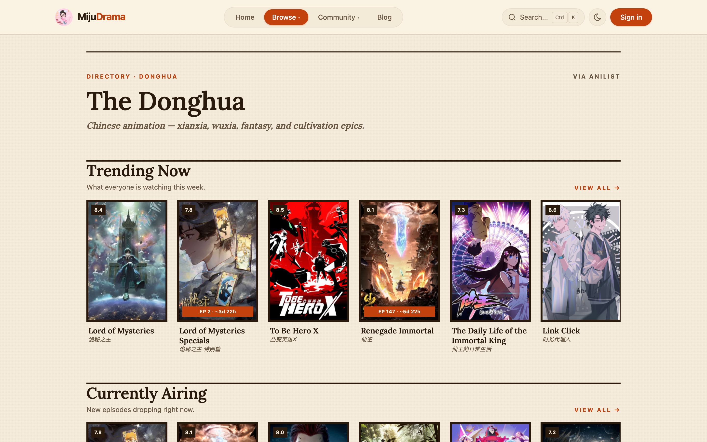

# MijuDrama

**A modern platform for discovering, tracking, rating, and discussing Asian drama, donghua, and manhua.**

### [🌐 mijudrama.com](https://mijudrama.com)

---

**MijuDrama** is a modern Asian-entertainment database and editorial blog for **discovering, tracking, rating, and discussing** Chinese dramas, **donghua** (Chinese animation), **manhua** (Chinese comics), films, and the people behind them. Browse curated listings, build a watchlist, rate and review titles, follow live next-episode countdowns, join the community forum, and read in-depth editorial coverage.

> 📖 This is a **public showcase** of the project. The application source code is private.

## ✨ Features

- **Catalog** — dramas, movies, variety, donghua & manhua, with sectioned listings (Trending / Currently Airing / Recently Added / Top Rated / Upcoming) and rich filter/sort.
- **Track** — personal watchlist (want / watching / watched), 1–10 ratings + written reviews, and custom public lists.
- **Donghua & Manhua** — AniList-powered directory with **live next-episode countdowns**, legal "where to watch / where to read" links, seasons, staff, characters, and recommendations.
- **Community** — threaded comments, a discussion **forum**, character search, and per-title community stats.
- **Editorial blog** — a custom Lexical rich-text editor, drama review posts, and people/actor profiles with filmographies.
- **Polish** — dark mode, SEO-first rendering (ISR, structured data, sitemaps), and an accessible, responsive UI.

## 🛠 Tech Stack

| Area | Technology |
|---|---|
| Framework | Next.js 15 (App Router, Turbopack) · React 19 |
| Language | TypeScript |
| Styling | Tailwind CSS 4 · Radix UI |
| Database | Prisma 6 + MongoDB (Atlas) |
| Auth | better-auth (email/password, Google, 2FA, admin) |
| Infra | Upstash Redis · Cloudinary + Cloudflare R2 · Resend |
| Testing | Vitest · Playwright + Lighthouse |
| Data | TMDB · AniList · Wikidata |

## 📸 Screenshots

### Home

### Donghua Directory

### Title Detail

<!-- Drop your PNGs into assets/screenshots/ with these names (or edit the paths above). -->

## 📄 License

[MIT](LICENSE) © bunseueng
